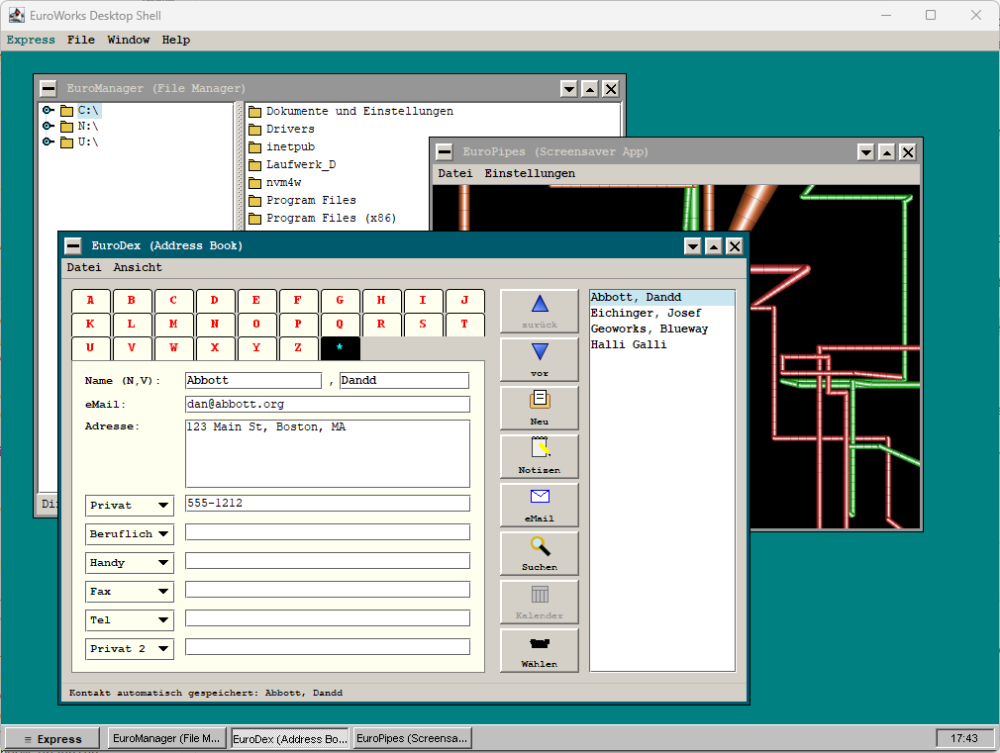

# EuroWorks Desktop

[](#)
[](#)
[](#)

**EuroWorks** is a retro-inspired, modern desktop environment built for Java systems. Heavily inspired by the classic **GeoWorks** (PC-GEOS/BreadBox Ensemble) and Windows 95 aesthetics, it recreates the vintage pixel look while utilizing modern multi-threaded execution, 3D raycasting, and hardware-accelerated 2D graphics.

---



## 🌟 Key Features

### 🖥️ The Desktop Shell
* **Express Launcher**: A bottom-left pop-up menu providing access to all system applications, utilities, and shutdown commands.
* **3D Taskbar**: A silver taskbar with authentic 3D raised and sunken styles, utilizing checkered dither patterns to indicate active and inactive applications.
* **Taskbar Clock**: A sunken 24-hour digital clock widget updating in real-time.
* **Window Management**: Classic cascading and tiling options for organized multitasking.
* **Color Customization**: Instantly customize the desktop backdrop color (Retro Teal, Navy Blue, VGA Gray, Forest Green, Dark Red).

### 📁 Built-in Applications
* **EuroManager (File Manager)**: A vintage file tree navigator with lazy-loaded drive/directory structures and double-click navigation.
* **EuroMandelbrot (Fractal Explorer)**: An advanced multi-pass progressive refinement fractal renderer (16x16 down to 1x1 block passes) with interactive drag-zoom and retro color palettes (Rainbow, Fire, Ice-Blue, Original GEOS Rings).
* **EuroMines (Minesweeper)**: A pixel-perfect classic Minesweeper game featuring custom 3D bevels, 3-digit LED displays, first-click mine safety, flag markings, cascading cell reveals, and difficulty settings (Beginner, Intermediate, Expert).
* **EuroBreakout (Classic Breakout)**: An authentic replica of the 1976 arcade game. Features 8 colored rows of bricks, smooth mouse-motion/keyboard paddle tracking, 5-lives serve logic, and sound blips.
* **EuroInvaders (Space Invaders)**: A classic replica of the 1978 arcade Space Invaders. Features 2-frame walking alien sprites, crumbling defensive shields, speeding march tempos, random high-flying UFO saucer events, 8-bit chiptune sound effect loops, and username high scores.
* **EuroCDPlayer (CD Player)**: A full replica of the classic Windows 95 CD Player application. Features a dark-blue LCD status display, track time/disc time counting, a working interactive volume slider, skip/rewind/fast-forward/play/pause/stop/eject controls, and vector-rendered Compact Disc branding.
* **EuroPreferences (Control Panel)**: Settings center to customize desktop backgrounds, toggle Speaker Emulation, outline window dragging, and configure screensavers.
* **EuroScan (Flatbed Scanner)**: Scan documents and photos directly from any connected flatbed scanner. Uses WIA (Windows Image Acquisition) on Windows and the SANE `scanimage` CLI on Linux/macOS. Features scanner enumeration and selection, a fit-to-panel image viewer with mouse-wheel zoom and right-drag pan, interactive crop tool with 8 resize handles and a live pixel-size readout, one-click 90° rotation, and JPEG/PNG export.
* **Retro Mock Applications**: Authentic mocks of classic suites like `EuroWrite`, `EuroDraw`, `EuroCalc`, and `EuroFile`.

### 🌌 Retro Screensavers
* **EuroStarfield**: 3D fly-through space simulator. Simulates motion blur using projected speed-streak trails, adjustable star count (up to 5000 "Cosmic" stars), and spacecraft camera-roll rotation.
* **EuroMaze**: A first-person 3D maze walk-through powered by a custom DDA (Digital Differential Analysis) raycaster writing directly to raster buffers, featuring realistic brick textures.
* **EuroPipes**: 3D perspective pipes generator with 90-degree bends and color-cycling paths.
* **EuroBezier**: Bouncing, multi-point color-cycling Bezier curves inspired by classic screensaver loops.

---

## 🛠️ Architecture & Technology Stack

* **Core**: Java 26 & Swing / AWT.
* **Graphics**: Direct pixel manipulation on buffer arrays backed by `DataBufferInt` to bypass standard graphics pipelines for high-performance 3D rendering (raycasting and starfield loops).
* **Build Tool**: Maven.
* **Application Framework**: Spring Boot.

---

## 🚀 Getting Started

### Prerequisites
* **Java Development Kit (JDK) 26** or higher.
* Maven wrapper (`mvnw`) included in the project directory.

### Build and Package
To clean and package the project into a runnable JAR, execute:
```bash
./mvnw clean package
```

### Launch the Shell
Run the application using Spring Boot:
```bash
./mvnw spring-boot:run
```

---

## ⚙️ Settings & Inactivity Timer
By default, EuroWorks monitors user activity (mouse and keyboard input). If the system detects inactivity for the duration set in `EuroPreferences` (default: 10 seconds), the selected Screensaver automatically launches in a borderless, undecorated fullscreen mode. Move the mouse or press any key to instantly dismiss the screensaver and return to the desktop.

---

## 🎨 Icon Themes & Menu Structures (Freedesktop Specification)

EuroWorks supports dynamic launcher menus and icon theme switching according to standard Freedesktop specifications:

* **Menu Structure**: Loaded and parsed from `~/.euroworks/.config/menus/menus.xml` (using standard XML submenus, filename tags, and separators).
* **Desktop Application Entries**: Configured via `.desktop` files under `~/.euroworks/share/applications/` specifying application name, command, and icon keys.
* **Icon Themes**: Loaded and scanned from `~/.euroworks/share/icons/` using the standard `index.theme` format. Falls back gracefully to packaged classpath resources or programmatic vector icons if not found.
* **Automatic Theme Synchronizer**: On application startup, the default `"Euro"` theme configuration, XML menus, `.desktop` launcher items, and scalable SVG icons are automatically copied from the classpath to their standard locations under `~/.euroworks/` if not already present, making the environment completely data-driven.

---

## 🖨️ EuroScan – Scanner Prerequisites & Features

EuroScan acquires images from a connected flatbed scanner using the platform-native scanning subsystem. No additional Java library or JAR is required, but the OS-level scanner tooling must be present and the scanner must have a compatible driver installed.

### Features

| Feature | Description |
|---|---|
| **Scanner auswählen** | Enumerates all connected WIA (Windows) or SANE (Linux) devices on a background thread and shows a selection dialog |
| **Scannen** | Scans at 200 dpi, colour mode, via WIA (PowerShell) on Windows or `scanimage` on Linux/macOS |
| **Zoom** | Mouse-wheel to zoom in/out centred on cursor; `+` / `−` buttons zoom centred on panel; `⊡` resets to fit; zoom label shows current level (`Einpassen` or e.g. `240%`) |
| **Crop tool** | Drag to draw a selection rectangle; 8 resize handles (4 corners + 4 midpoints) to adjust; dark overlay dims outside the crop zone; rule-of-thirds guide lines; live pixel-size label |
| **Drehen +90°** | Rotates the image 90° clockwise |
| **Speichern** | Saves the current image (after any cropping/rotation) as JPEG (default) or PNG via a file chooser |

### Crop Tool Usage

1. After scanning, **drag** anywhere on the image to draw a crop rectangle.
2. Drag **inside** the rectangle to move it; drag a **handle** to resize it.
3. Click **✂ Zuschneiden** to crop. The cropped image replaces the original.
4. You can crop multiple times, or rotate first and then crop.
5. Clicking outside the rectangle (but not on a handle) starts a new selection.

### Zoom & Pan Usage

| Input | Action |
|---|---|
| **Scroll wheel up** | Zoom in, centred on mouse cursor |
| **Scroll wheel down** | Zoom out, centred on mouse cursor |
| **`+` button** | Zoom in, centred on panel |
| **`−` button** | Zoom out, centred on panel |
| **`⊡` button** | Reset to fit-to-panel |
| **Right-drag** | Pan the image (when zoomed in) |

> [!TIP]
> Zoom into a specific edge or corner you want to crop precisely, then drag your selection — the crop coordinates are always in full image pixels regardless of zoom level.

---

### Windows (WIA – Windows Image Acquisition)

EuroScan uses **WIA** via a PowerShell script. WIA is built into all Windows XP and later systems and handles the 32-bit/64-bit TWAIN driver bridging internally.

**Requirements:**
1. **A WIA-compatible scanner driver** – most modern scanner manufacturers (Canon, Epson, HP, Brother, Fujitsu, etc.) ship a WIA driver alongside their standard software package.
   - If your scanner appears in **Control Panel → Devices and Printers** but not under **Control Panel → Scanners and Cameras**, install the WIA driver separately from the manufacturer's support page.
   - Quick sanity check: open **Windows Fax and Scan** (built into Windows) and verify your scanner appears and can scan before using EuroScan.
2. **PowerShell 5+** – included with Windows 10 and Windows 11 (no additional installation needed).
3. **Scanner powered on and USB/network connected** before starting a scan.

**Troubleshooting:**
- "No WIA scanner found": open **Control Panel → Scanners and Cameras** (or run `wiaacmgr.exe`) and check your device is listed.
- If Windows Fax and Scan cannot scan, EuroScan will not be able to either.
- Some older scanners only ship TWAIN drivers (no WIA). Check the manufacturer's website for an updated WIA driver.
- Scanning appears in **black & white (bitonal)**: ensure the scanner driver exposes the `WIA_IPA_DATATYPE` property (property ID 4103). Most modern WIA drivers support colour; if not, update to the latest driver.

---

### Linux (SANE – Scanner Access Now Easy)

EuroScan calls the `scanimage` command-line tool from the **SANE** project.

**Requirements:**
1. **Install `sane-utils`:**

   | Distribution        | Command                                              |
   |---------------------|------------------------------------------------------|
   | Debian / Ubuntu     | `sudo apt install sane-utils`                        |
   | Fedora / RHEL       | `sudo dnf install sane-backends`                     |
   | Arch Linux          | `sudo pacman -S sane`                                |
   | openSUSE            | `sudo zypper install sane-backends`                  |

2. **Verify the scanner is detected:**
   ```bash
   scanimage -L
   ```
   Example output:
   ```
   device 'epson2:usb:001:003' is a Epson Perfection V600 flatbed scanner
   ```
   If no device is listed, the scanner may not have a SANE backend. Check the supported devices list at [sane-project.org/sane-supported-devices.html](http://www.sane-project.org/sane-supported-devices.html).

3. **Permissions** – on some distributions, the user must be in the `scanner` group to access USB scanners without `sudo`:
   ```bash
   sudo usermod -aG scanner $USER
   # Then log out and back in
   ```

4. **Network scanners (SANE over network)** – if your scanner is connected to another machine running `saned`, set the hostname in `/etc/sane.d/net.conf`. EuroScan will automatically use it once `scanimage -L` lists it.

**Troubleshooting:**
- Run `scanimage --test` to verify the SANE backend can connect to the scanner.
- USB scanners not in the SANE supported device list may still work if the manufacturer provides a proprietary SANE plugin (e.g. Epson Image Scan, Brother brscan).

---

### macOS

Install SANE backends via [Homebrew](https://brew.sh/):
```bash
brew install sane-backends
```
Verify with `scanimage -L`. Apple's AirScan framework may also expose the scanner; configure the SANE `airscan` backend if needed.


